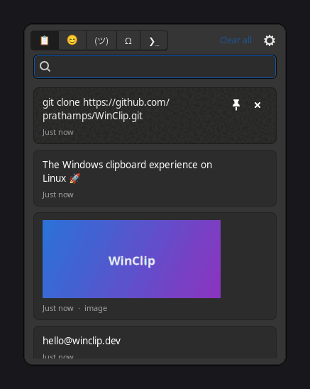

# WinClip

**The Windows clipboard experience (Win+V) for Linux.**

WinClip is a clipboard history manager for Linux desktops (Debian/Ubuntu,
Arch/Omarchy, GNOME, COSMIC, Hyprland, …) that recreates the Windows 11
clipboard panel: press <kbd>Super</kbd>+<kbd>V</kbd>,
see everything you've copied, click an item, and it's pasted into the app you
came from.

<p align="center">
  
</p>

## Features

- **Clipboard history** — every text snippet and image you copy is captured
  by a lightweight background daemon (Wayland and X11).
- **Super+V panel** — a searchable popup with previews, image thumbnails,
  and relative timestamps. <kbd>Esc</kbd> dismisses it, <kbd>Enter</kbd>
  pastes the selection, exactly like Windows.
- **Pick → paste** — selecting an item copies it and injects
  <kbd>Ctrl</kbd>+<kbd>V</kbd> into the previously focused window
  (via `ydotool`/`wtype`/`xdotool`; falls back to copy-only with a
  notification when no injection tool is available).
- **Pin items** — pinned entries are never evicted and survive *Clear all*.
- **Emoji, kaomoji & symbols** — searchable picker tabs (😊 / (ツ) / Ω),
  just like the Windows panel: click to paste ¯\\\_(ツ)\_/¯, →, ₹, or 🚀
  into whatever you're writing.
- **Shell command history** — a ❯\_ tab that reads your bash/zsh/fish
  history and groups it by tool (docker, npm, kubectl, …) with
  zoxide-style frecency ranking: click a command to paste it into your
  terminal. Can be disabled in Preferences if you'd rather it never
  read shell history.
- **Windows-faithful semantics** — re-copying an existing item moves it to
  the top instead of duplicating it; history is capped (50 items by default)
  with a 4 MiB per-item limit; oldest unpinned items are evicted first.
- **Persistent** — history lives in SQLite under `~/.local/share/winclip`
  and survives reboots.
- **Omarchy themes** — on [Omarchy](https://omarchy.org) the panel takes
  its colours, font, and corner rounding from the active theme, exactly
  like Omarchy's built-in menus, and follows `omarchy theme set` the next
  time it opens.
- **Configurable** — history size, image capture, auto-paste, and the paste
  tool, via the in-panel preferences dialog or `winclip config`.
- **No pip dependencies** — pure Python standard library plus the
  system-packaged PyGObject/GTK 3 and `wl-clipboard`.

## Installation

### Debian package (recommended)

Grab the `.deb` from the [latest release](https://github.com/prathamps/WinClip/releases):

```bash
sudo apt install ./winclip_*_all.deb
systemctl --user enable --now winclip.service
```

### pipx

```bash
# Debian / Ubuntu
sudo apt install python3-gi gir1.2-gtk-3.0 gir1.2-gtklayershell-0.1 wl-clipboard pipx
# Arch / Omarchy
sudo pacman -S python-gobject gtk3 gtk-layer-shell wl-clipboard wtype python-pipx

pipx install --system-site-packages winclip
```

### From source (Debian / Ubuntu / Arch / Omarchy)

```bash
git clone https://github.com/prathamps/WinClip.git
cd WinClip
./scripts/install.sh
```

The installer:

1. installs missing system packages with apt or pacman (PyGObject, GTK 3,
   `wl-clipboard`, `gtk-layer-shell` on Wayland, and a paste-injection
   tool),
2. installs the `winclip` command into its own virtualenv,
3. enables a systemd user service so the daemon starts with your session,
4. on GNOME, COSMIC, and Hyprland (including Omarchy), binds
   <kbd>Super</kbd>+<kbd>V</kbd> to the panel — taking it over from the
   GNOME notification list, Hyprland's float toggle, or Omarchy's
   universal paste.

On Hyprland the binding and window rules live in
`~/.config/hypr/winclip.lua` (or `winclip.conf` on releases before 0.55),
pulled in by one line at the end of your main config — edit or delete
that file to change the key. On other desktops, bind a shortcut to
`winclip toggle` in your DE's keyboard settings.

Uninstall with `./scripts/uninstall.sh` (add `--purge` to also delete your
history and settings).

## Usage

| Action | How |
|---|---|
| Open/close the panel | <kbd>Super</kbd>+<kbd>V</kbd> (or `winclip toggle`) |
| Switch tabs (clips / emoji / kaomoji / symbols / commands) | Click, <kbd>Ctrl</kbd>+<kbd>Tab</kbd> / <kbd>Ctrl</kbd>+<kbd>Shift</kbd>+<kbd>Tab</kbd>, <kbd>Ctrl</kbd>+<kbd>PgDn</kbd>/<kbd>PgUp</kbd>, or <kbd>Alt</kbd>+<kbd>1</kbd>–<kbd>5</kbd> |
| Paste an item | Click it, or <kbd>↑</kbd>/<kbd>↓</kbd> + <kbd>Enter</kbd> |
| Search the active tab | Just type in the search box |
| Search → keyboard pick | <kbd>↓</kbd> moves into the list/grid; on emoji tabs <kbd>Enter</kbd> inserts the first match |
| Pin / unpin | Pin button, or <kbd>Ctrl</kbd>+<kbd>P</kbd> |
| Delete an item | ✕ button, or <kbd>Del</kbd> |
| Clear history (keeps pinned) | *Clear all* button |
| Move the panel | Drag any empty area |
| Resize the panel | Drag an edge — the size is remembered |
| Dismiss | <kbd>Esc</kbd> or click elsewhere |

On compositors where the panel is a layer-shell surface (Hyprland, sway,
river, niri, KDE — see *How it works*) it always opens centered and is
not draggable or resizable; set its size with
`winclip config panel_width 400` / `panel_height 600` instead.

### CLI

```bash
winclip              # run the daemon in the foreground
winclip toggle       # show/hide the panel (what Super+V invokes)
winclip list         # print history to stdout
winclip clear        # clear unpinned history
winclip paste 9c6e   # copy+paste an item by id prefix (rofi/wofi friendly)
winclip config                     # show all settings
winclip config max_items 100       # change a setting
winclip quit         # stop the daemon
```

### Settings

Stored at `~/.config/winclip/settings.json`:

| Key | Default | Meaning |
|---|---|---|
| `max_items` | `50` | unpinned items kept in history |
| `max_item_bytes` | `4194304` | per-item size cap (4 MiB, like Windows) |
| `capture_images` | `true` | capture copied images |
| `auto_paste` | `true` | inject Ctrl+V after selecting an item |
| `paste_tool` | `auto` | `auto`, `none`, `ydotool`, `wtype`, or `xdotool` |
| `show_commands` | `true` | shell-command tab; off = shell history is never read |

## How it works

- **Wayland**: `wl-paste --watch` (data-control protocol — supported by
  GNOME 46+, KDE, and wlroots compositors) notifies the daemon of clipboard
  changes; content is fetched with one-shot `wl-paste` calls and written
  back with `wl-copy`.
- **X11**: the GTK clipboard's `owner-change` signal provides change
  notifications, and GTK reads/writes the selection directly.
- **Tiling compositors**: with `gtk-layer-shell` installed, the panel is a
  layer-shell overlay surface rather than a window, so Hyprland, sway,
  river, niri, and KDE never tile it — it opens centered above whatever
  you are working in, whether that window is tiled or floating, and
  disappears without disturbing the layout. Without gtk-layer-shell (and
  always on GNOME, which offers no layer-shell to apps) the panel is a
  regular toplevel; on Hyprland the installer also writes float/center
  window rules so that fallback, and the Preferences dialog, never tile.
- **Omarchy theming**: when
  `~/.local/state/omarchy/current/theme/colors.toml` exists, its
  background, foreground, accent, and muted colours are mapped onto GTK's
  named colours for the panel, the font becomes fontconfig's `monospace`
  (the font `omarchy font set` picks), and the corner radius follows
  Hyprland's `decoration:rounding`. The file is re-read every time the
  panel opens, so no hook is needed.
- Paste injection probes `ydotool` → `wtype` on Wayland and `xdotool` on
  X11. On GNOME Wayland, `ydotool` (with its daemon enabled) is the reliable
  choice; on Hyprland and other wlroots-style compositors `wtype` works out
  of the box. Without any tool WinClip still copies and notifies you to
  press Ctrl+V yourself.

## Architecture

WinClip is a textbook **hexagonal (ports & adapters)** codebase — the
domain and use cases are pure Python with zero I/O, and every technology
(SQLite, GTK, wl-clipboard, subprocess injection) sits behind a port. The
dependency rule is enforced by a test (`tests/unit/test_architecture.py`).

See [docs/ARCHITECTURE.md](docs/ARCHITECTURE.md) for the full picture,
including how to add a new adapter (e.g. a GTK 4 panel or a KDE monitor).

## Development

```bash
make dev    # venv with pytest + ruff (uses system PyGObject)
make test
make lint
make run    # run the daemon from the working tree
```

Contributions welcome — see [CONTRIBUTING.md](CONTRIBUTING.md).

## License

[MIT](LICENSE)
